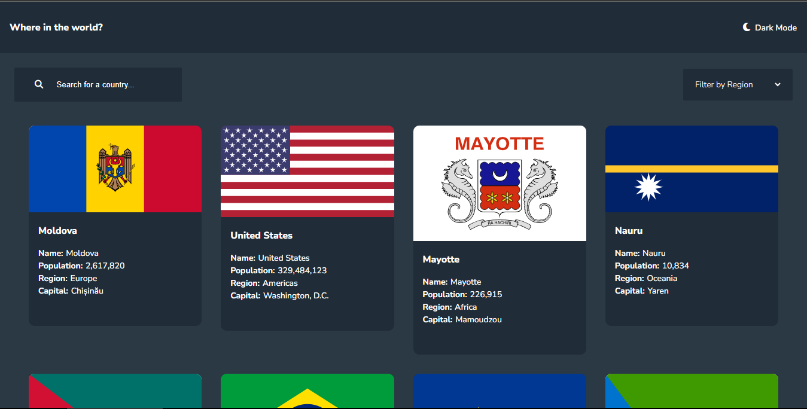

# Frontend Mentor - REST Countries API with color theme switcher solution

This is a solution to the [REST Countries API with color theme switcher challenge on Frontend Mentor](https://www.frontendmentor.io/challenges/rest-countries-api-with-color-theme-switcher-5cacc469fec04111f7b848ca). Frontend Mentor challenges help you improve your coding skills by building realistic projects. 

## Table of contents

- [Overview](#overview)
  - [The challenge](#the-challenge)
  - [Screenshot](#screenshot)
  - [Links](#links)
- [My process](#my-process)
  - [Built with](#built-with)
  - [What I learned](#what-i-learned)
  - [Continued development](#continued-development)
- [Author](#author)

## Overview

### The challenge

Users should be able to:

- See all countries from the API on the homepage
- Search for a country using an `input` field
- Filter countries by region
- Click on a country to see more detailed information on a separate page
- Click through to the border countries on the detail page
- Toggle the color scheme between light and dark mode *(optional)*

### Screenshot

### Links

[- Solution](https://www.frontendmentor.io/solutions/rest-countries-with-color-theme-switcher-TbpedblmMY)

[- Live Site](https://rest-countries-fem-challenge-03.netlify.app/)

## My process

### Built with

- React 
- Tailwind 
- Mobile-first workflow

### What I learned

After migrating this project from vanilla JavaScript to React, I gained valuable experience in using React, particularly with custom hooks. This migration provided me with hands-on experience in implementing various React hooks in a real-world project. The process was both challenging and enjoyable, allowing me to enhance my React skills significantly.

Additionally, integrating Tailwind CSS into the project improved the overall design and development efficiency. The combination of React and Tailwind CSS made the project more maintainable and visually appealing.

This migration was not only a technical upgrade but also an opportunity for personal growth as a developer. I'm excited to continue building on this foundation and applying what I've learned to future projects.
### Continued development

I plan to continue making improvements to this project over time. I recognize that there is still room for enhancement in some of the code, and refining these aspects will be my primary focus moving forward. Continuous improvement is key, and I’m committed to iterating and optimizing the project as I progress.

## Author

- Github - [Frost](https://github.com/Bear-Frost )
- Frontend Mentor - [@Frost](https://www.frontendmentor.io/profile/Bear-Frost)